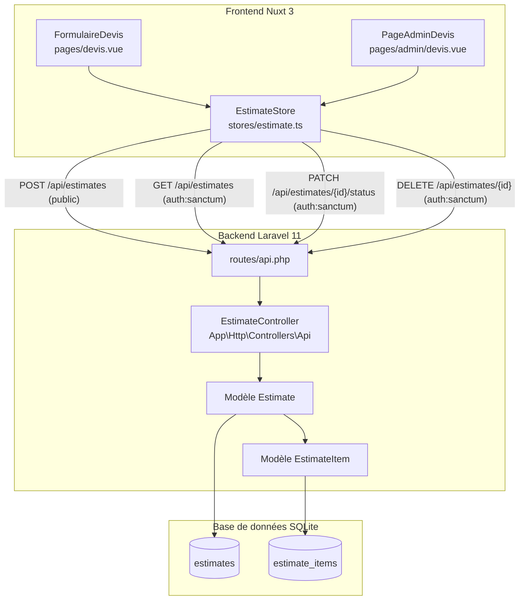
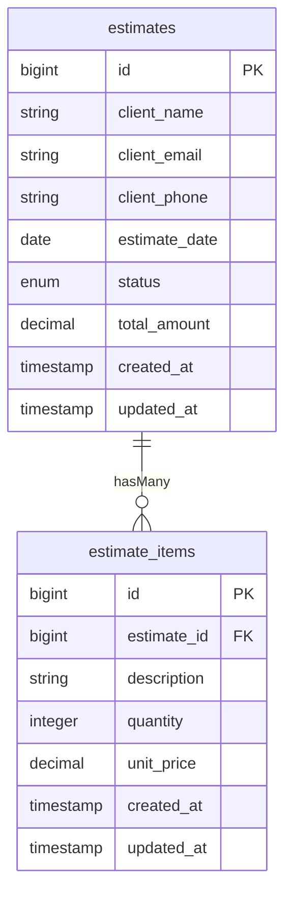

# Document de Design — Gestion des Devis (`estimate-management`)

## Overview

La fonctionnalité de gestion des devis permet à un client non authentifié de soumettre une demande de devis en ligne (sélection de produits du catalogue, saisie de ses coordonnées), et à l'administrateur de consulter, filtrer, changer le statut et supprimer ces devis depuis un espace sécurisé.

Le système repose sur deux couches :

- **Backend** : API REST Laravel 11, authentification Sanctum, base de données SQLite.
- **Frontend** : Nuxt 3, store Pinia TypeScript, pages publique et admin.

Plusieurs éléments existent déjà dans le code mais sont incomplets ou mal configurés. Ce design documente l'état cible et les corrections à apporter.

---

## Architecture



**Flux de soumission (client public) :**
1. Le client remplit le `FormulaireDevis` et sélectionne des produits depuis le catalogue.
2. Le store appelle `POST /api/estimates` (route publique).
3. L'`EstimateController` valide, crée le devis, crée les lignes, calcule `total_amount`, retourne 201.

**Flux de gestion (administrateur) :**
1. L'admin se connecte via Sanctum (token stocké dans le store auth).
2. La `PageAdminDevis` charge la liste via `GET /api/estimates`.
3. L'admin peut changer le statut (`PATCH`) ou supprimer (`DELETE`) un devis.

---

## Components and Interfaces

### Backend

#### `EstimateController` (`App\Http\Controllers\Api\EstimateController`)

> **Correction requise** : le fichier existant déclare `namespace App\Http\Controllers` — il doit être corrigé en `App\Http\Controllers\Api`.

| Méthode | Route | Auth | Description |
|---|---|---|---|
| `store(Request)` | `POST /api/estimates` | Publique | Crée un devis avec ses lignes |
| `index()` | `GET /api/estimates` | `auth:sanctum` | Liste paginée (15/page, tri `created_at` DESC) |
| `updateStatus(Request, id)` | `PATCH /api/estimates/{id}/status` | `auth:sanctum` | Met à jour le statut |
| `destroy(id)` | `DELETE /api/estimates/{id}` | `auth:sanctum` | Supprime le devis et ses lignes |

**Règles de validation — `store()` :**

```php
[
    'client_name'        => 'required|string|max:255',
    'client_email'       => 'required|email|max:255',
    'client_phone'       => 'nullable|string|max:20',
    'estimate_date'      => 'required|date',
    'items'              => 'required|array|min:1',
    'items.*.description'=> 'required|string|max:255',
    'items.*.quantity'   => 'required|integer|min:1',
    'items.*.unit_price' => 'required|numeric|min:0',
]
```

**Calcul du `total_amount` dans `store()` :**

```php
$totalAmount = collect($validated['items'])
    ->sum(fn($item) => $item['quantity'] * $item['unit_price']);
```

#### Modèle `Estimate`

> **Correction requise** : `$fillable` incomplet — ajouter `client_email`, `client_phone`, `status`, `total_amount`.

```php
protected $fillable = [
    'client_name', 'client_email', 'client_phone',
    'estimate_date', 'status', 'total_amount',
];

protected $casts = [
    'estimate_date' => 'date',
    'total_amount'  => 'decimal:2',
];

public function items(): HasMany
{
    return $this->hasMany(EstimateItem::class);
}
```

#### Modèle `EstimateItem`

Aucune modification requise. `$fillable` et relation `belongsTo` sont corrects.

#### Routes (`routes/api.php`)

> **Correction requise** : ajouter `POST /api/estimates` en dehors du groupe `auth:sanctum`.

```php
// Route publique — soumission de devis
Route::post('/estimates', [EstimateController::class, 'store']);

// Routes protégées — gestion admin
Route::middleware('auth:sanctum')->group(function () {
    Route::get('/estimates', [EstimateController::class, 'index']);
    Route::patch('/estimates/{id}/status', [EstimateController::class, 'updateStatus']);
    Route::delete('/estimates/{id}', [EstimateController::class, 'destroy']);
});
```

### Frontend

#### Store Pinia `stores/estimate.ts`

```typescript
interface EstimateItem {
  description: string
  quantity: number
  unit_price: number
}

interface EstimatePayload {
  client_name: string
  client_email: string
  client_phone?: string
  estimate_date: string
  items: EstimateItem[]
}

interface Estimate {
  id: number
  client_name: string
  client_email: string
  client_phone: string | null
  estimate_date: string
  status: 'pending' | 'approved' | 'rejected'
  total_amount: string
  items: EstimateItem[]
  created_at: string
}

interface EstimateState {
  estimates: Estimate[]
  pagination: { current_page: number; last_page: number; total: number } | null
  submitting: boolean
  loading: boolean
  lastCreatedId: number | null
  error: string | null
}
```

**Actions exposées :**

| Action | Description |
|---|---|
| `submitEstimate(payload)` | POST /api/estimates — met `submitting` à true/false, stocke `lastCreatedId` |
| `fetchEstimates(page?)` | GET /api/estimates — stocke la liste paginée dans `estimates` |
| `updateStatus(id, status)` | PATCH /api/estimates/{id}/status — met à jour le statut localement |
| `deleteEstimate(id)` | DELETE /api/estimates/{id} — retire le devis de `estimates` |

#### Page publique `pages/devis.vue`

Composants de la page :
- Champs client : `client_name`, `client_email`, `client_phone`, `estimate_date`
- Sélecteur de produits (chargé depuis `GET /api/products`)
- Liste des lignes de devis (ajout, modification quantité, suppression)
- Affichage du total calculé en temps réel
- Bouton de soumission (désactivé pendant `submitting`)
- Message de confirmation / erreurs

#### Page admin `pages/admin/devis.vue`

Composants de la page :
- Tableau des devis avec colonnes : nom, email, téléphone, date, total, statut, nb lignes, actions
- Badge coloré par statut (`pending` → jaune, `approved` → vert, `rejected` → rouge)
- Sélecteur de statut inline par devis
- Bouton de suppression avec modale de confirmation
- Indicateur de chargement global
- Affichage des erreurs API
- Middleware de redirection si non authentifié

---

## Data Models

### Table `estimates` (état cible)

> **Migration `alter` requise** : ajouter `client_email`, `client_phone`, `status`, `total_amount`.

| Colonne | Type | Contraintes | Défaut |
|---|---|---|---|
| `id` | bigint unsigned | PK, auto-increment | — |
| `client_name` | varchar(255) | NOT NULL | — |
| `client_email` | varchar(255) | NOT NULL | — |
| `client_phone` | varchar(20) | nullable | NULL |
| `estimate_date` | date | NOT NULL | — |
| `status` | enum('pending','approved','rejected') | NOT NULL | `'pending'` |
| `total_amount` | decimal(10,2) | NOT NULL | `0.00` |
| `created_at` | timestamp | nullable | — |
| `updated_at` | timestamp | nullable | — |

### Table `estimate_items` (aucune modification)

| Colonne | Type | Contraintes |
|---|---|---|
| `id` | bigint unsigned | PK, auto-increment |
| `estimate_id` | bigint unsigned | FK → estimates(id) ON DELETE CASCADE |
| `description` | varchar(255) | NOT NULL |
| `quantity` | integer | NOT NULL |
| `unit_price` | decimal(10,2) | NOT NULL |
| `created_at` | timestamp | nullable |
| `updated_at` | timestamp | nullable |

### Diagramme entité-relation



---

## Correctness Properties

*Une propriété est une caractéristique ou un comportement qui doit rester vrai pour toutes les exécutions valides d'un système — c'est essentiellement un énoncé formel de ce que le système doit faire. Les propriétés servent de pont entre les spécifications lisibles par l'humain et les garanties de correction vérifiables par machine.*

### Property 1: Statut par défaut à la création

*Pour tout* payload de création de devis valide ne spécifiant pas de statut, le devis créé doit avoir le statut `pending`.

**Validates: Requirements 1.2**

---

### Property 2: Suppression en cascade des lignes

*Pour tout* devis possédant N lignes, après suppression du devis, aucune ligne `estimate_items` associée à cet identifiant ne doit subsister en base de données.

**Validates: Requirements 1.3**

---

### Property 3: Calcul correct du MontantTotal

*Pour tout* ensemble de lignes de devis avec des quantités et prix unitaires quelconques, le champ `total_amount` persisté doit être strictement égal à la somme de (`quantity × unit_price`) pour chaque ligne.

**Validates: Requirements 4.1, 4.3**

---

### Property 4: Présence de `total_amount` dans toutes les réponses

*Pour tout* devis retourné par l'API (via `GET /api/estimates` ou dans la réponse de `POST /api/estimates`), la réponse JSON doit contenir le champ `total_amount`.

**Validates: Requirements 4.2**

---

### Property 5: Validation — rejet des payloads invalides

*Pour tout* payload envoyé à `POST /api/estimates` qui viole au moins une règle de validation (email malformé, `items` vide, `quantity` < 1, `unit_price` < 0, `client_name` absent, `estimate_date` absente), la réponse doit être HTTP 422.

**Validates: Requirements 3.4, 3.5**

---

### Property 6: Création réussie pour tout payload valide

*Pour tout* payload valide envoyé à `POST /api/estimates` (tous les champs obligatoires présents, au moins une ligne valide), la réponse doit être HTTP 201 et contenir un `estimate_id` entier positif.

**Validates: Requirements 3.3**

---

### Property 7: Mise à jour du statut

*Pour tout* devis existant et tout statut valide parmi `{pending, approved, rejected}`, après un appel `PATCH /api/estimates/{id}/status`, le statut persisté en base doit correspondre au statut envoyé.

**Validates: Requirements 3.7**

---

### Property 8: Protection des routes admin — HTTP 401

*Pour chacune* des routes protégées (`GET /api/estimates`, `PATCH /api/estimates/{id}/status`, `DELETE /api/estimates/{id}`), une requête sans token Sanctum valide doit retourner HTTP 401.

**Validates: Requirements 5.3**

---

### Property 9: Pagination et tri de la liste

*Pour tout* ensemble de N devis en base (N > 0), la réponse de `GET /api/estimates` doit contenir au plus 15 éléments par page, et les éléments de chaque page doivent être triés par `created_at` décroissant.

**Validates: Requirements 3.6**

---

### Property 10: Cycle d'état `submitting` du store

*Pour tout* appel à `submitEstimate(payload)`, l'état `submitting` doit passer à `true` pendant la requête et revenir à `false` à la fin, que la requête réussisse ou échoue.

**Validates: Requirements 6.2**

---

### Property 11: Calcul du total côté client (FormulaireDevis)

*Pour toute* liste de lignes de devis affichée dans le `FormulaireDevis`, le total affiché en temps réel doit être égal à la somme de (`quantity × unit_price`) pour chaque ligne présente.

**Validates: Requirements 7.5**

---

### Property 12: Retrait du devis supprimé de l'état local

*Pour tout* devis présent dans l'état `estimates` du store, après un appel réussi à `deleteEstimate(id)`, ce devis ne doit plus apparaître dans l'état `estimates`.

**Validates: Requirements 6.7, 8.6**

---

## Error Handling

### Backend

| Situation | Code HTTP | Corps de réponse |
|---|---|---|
| Validation échouée (`store`) | 422 | `{ "message": "...", "errors": { ... } }` |
| Devis introuvable (`updateStatus`, `destroy`) | 404 | `{ "message": "No query results for model..." }` |
| Requête non authentifiée (routes admin) | 401 | `{ "message": "Unauthenticated." }` |
| Erreur serveur inattendue | 500 | `{ "message": "Server Error" }` |

Laravel retourne automatiquement les 404 via `findOrFail()` et les 401 via le middleware `auth:sanctum`. Les 422 sont gérés par le système de validation de Laravel.

### Frontend

| Situation | Comportement |
|---|---|
| Erreur de validation API (422) | Affichage des messages d'erreur par champ, formulaire non réinitialisé |
| Erreur réseau / serveur (5xx) | Message d'erreur générique, `error` stocké dans le store |
| Token expiré (401 sur routes admin) | Redirection vers la page de connexion |
| Devis introuvable (404 sur PATCH/DELETE) | Message d'erreur explicite à l'admin |

---

## Testing Strategy

### Tests unitaires (PHPUnit — Backend)

Les tests unitaires couvrent les cas concrets et les cas limites :

- `EstimateController::store()` avec un payload valide → 201 + `estimate_id`
- `EstimateController::store()` avec email invalide → 422
- `EstimateController::store()` avec `items` vide → 422
- `EstimateController::store()` avec `quantity` = 0 → 422
- `EstimateController::updateStatus()` avec un ID inexistant → 404
- `EstimateController::destroy()` avec un ID inexistant → 404
- Accès à `GET /api/estimates` sans token → 401
- Vérification que `total_amount` est présent dans la réponse JSON

### Tests de propriétés (PHPUnit + bibliothèque PBT — Backend)

La bibliothèque recommandée est **[eris/eris](https://github.com/giorgiosironi/eris)** (PHP, compatible PHPUnit).

Chaque test de propriété doit s'exécuter avec un minimum de **100 itérations**.

Format de tag : `Feature: estimate-management, Property {N}: {texte}`

```php
// Exemple — Propriété 3 : Calcul du MontantTotal
// Feature: estimate-management, Property 3: total_amount = sum(qty * unit_price)
public function test_total_amount_equals_sum_of_items(): void
{
    $this->forAll(
        Generator\seq(Generator\tuple(
            Generator\pos(),          // quantity
            Generator\float(0, 9999)  // unit_price
        ))
    )->then(function (array $lines) {
        // ... créer le devis, vérifier total_amount
    });
}
```

**Propriétés à implémenter comme tests PBT :**

| Propriété | Tag |
|---|---|
| Propriété 1 — Statut par défaut | `Property 1: default status is pending` |
| Propriété 2 — Cascade suppression | `Property 2: cascade delete removes items` |
| Propriété 3 — Calcul MontantTotal | `Property 3: total_amount = sum(qty * unit_price)` |
| Propriété 4 — Présence total_amount | `Property 4: total_amount present in all responses` |
| Propriété 5 — Rejet payloads invalides | `Property 5: invalid payloads return 422` |
| Propriété 6 — Création payload valide | `Property 6: valid payloads return 201` |
| Propriété 7 — Mise à jour statut | `Property 7: status update persisted correctly` |
| Propriété 8 — Protection 401 | `Property 8: unauthenticated requests return 401` |
| Propriété 9 — Pagination et tri | `Property 9: pagination and ordering correct` |

### Tests de propriétés (Vitest + fast-check — Frontend)

La bibliothèque recommandée est **[fast-check](https://fast-check.dev/)** (TypeScript, compatible Vitest).

**Propriétés à implémenter :**

| Propriété | Tag |
|---|---|
| Propriété 10 — Cycle `submitting` | `Property 10: submitting state cycle` |
| Propriété 11 — Total côté client | `Property 11: client-side total calculation` |
| Propriété 12 — Retrait après suppression | `Property 12: deleted estimate removed from state` |

### Tests d'intégration / smoke

- Vérification que la migration `alter` ajoute bien les colonnes sans perte de données
- Vérification que `POST /api/estimates` est accessible sans authentification
- Vérification que les routes admin nécessitent un token Sanctum valide
